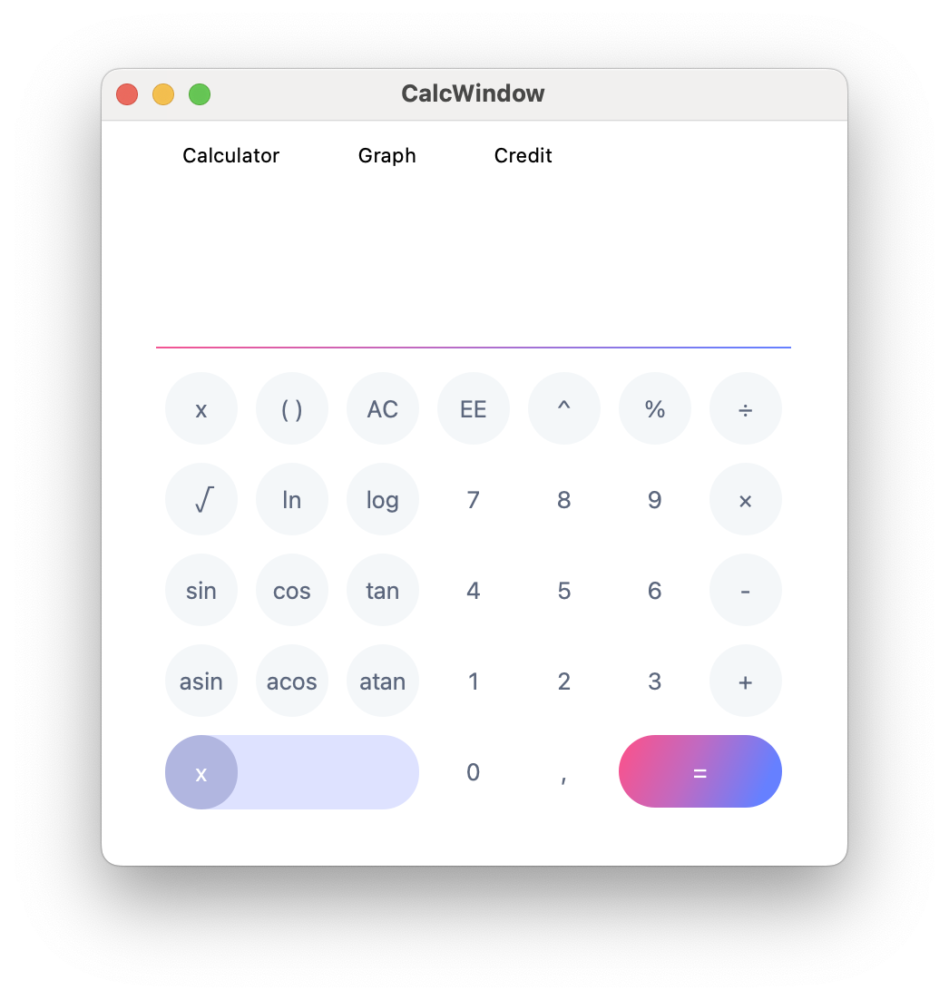
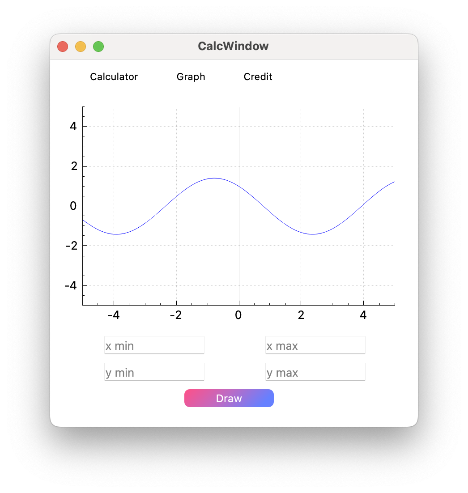
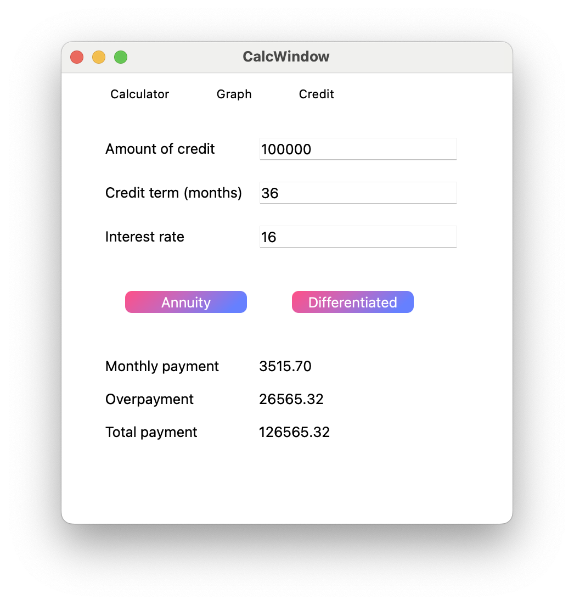

# SmartCalc v2.0

Реализация SmartCalc v2.0.

## Описание

Предыдущая версия калькулятора была написана на языке Си. В данном проекте была реализована расширенная версия обычного калькулятора на языке С++17 в парадигме ООП.

Помимо базовых арифметических операций, как плюс-минус и умножить-поделить, реализована возможностью вычисления арифметических выражений с учетом приоритетов, а также некоторыми математическими функциями (синус, косинус, логарифм и т.д.).

<p style="text-align:center" align="center">
  
</p>

Помимо вычисления выражений калькулятор поддерживает использование переменной x и построение графика соответствующей функции.

<p style="text-align:center" align="center">
  
</p>

### Кредитный калькулятор

В качестве дополнительных улучшений предусмотрен кредитный калькулятор. Кнопка Credit в верхнем баре меню переключает окно на кредитный кальнулятор. Пользователь вводит общую сумму кредита, срок, процентную ставку, тип кредита (аннуитетный, дифференцированный) и получает ежемесячный платеж, переплату по кредиту, сумму обзих выплат.

<p style="text-align:center" align="center">
  
</p>

В процессе создания были использованы MVP паттерн, Qt фреймворк, алгоритм Дейкстры (сортировочная станция) для вычисления значения математического выражения.

## Установка

Дла установки необходимы Qt версии 6, cmake, make и GCC компилятор.

```bash
git clone https://github.com/polings/SmartCalc.git
cd SmartCalc
make install
```